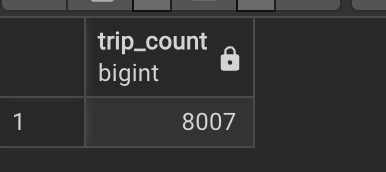
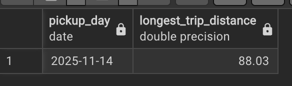
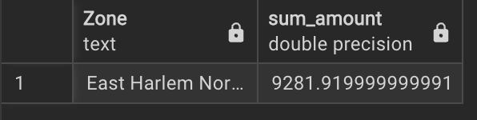
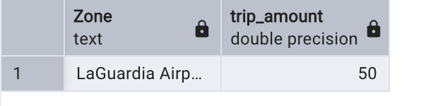

## Homework 1: Docker, SQL and Terraform

### Question 1: Understanding Docker images
Run docker with the python:3.13 image. Use an entrypoint bash to interact with the container.

What's the version of pip in the image?
- pip 25.3
```
root@06123fffc85:/# pip --version
pip 25.3 from /usr/local/lib/python3.13/site-packages/pip (python 3.13)
```


### Question 2: Understanding Docker networking and docker-compose
Given the following docker-compose.yaml, what is the hostname and port that pgadmin should use to connect to the postgres database?
- db:5432
Containers use their service names to connect to each other. 5432 is the internal port exposed by postgres image.

## Ingest Data into Postgres
For the following questions, I worked with the `yellow_tripdata_2021-01` and `taxi_zone_lookup` datasets. In a Jupyter notebook, I fetched the files with `wget`, cleaned the schemas, and persisted the results into Postgres through `SQLAlchemy`. The same `docker-compose.yaml` bootstraps both the Postgres and pgAdmin containers on a shared network, so the ingestion notebook (notebook.ipynb) can talk to the database by service name.

### Question 3. Counting short trips
For the trips in November 2025 (lpep_pickup_datetime between '2025-11-01' and '2025-12-01', exclusive of the upper bound), how many trips had a trip_distance of less than or equal to 1 mile?
- 8007
Query:
```
Select
COUNT (*) AS short_trip_count
FROM
green_tripdata_2025_11 t
WHERE
t. lpep_pickup_datetime <= DATE '2025-12-01' AND t. lpep_pickup_datetime >= DATE '2025-11-01'
AND t. trip_distance <= 1;
```



### Question 4. Longest trip for each day
Which was the pick up day with the longest trip distance? Only consider trips with trip_distance less than 100 miles (to exclude data errors).
- 2025-11-14
```
Select
DATE (t. lpep_pickup_datetime) AS pickup_day, MAX(t.trip_distance) AS longest_trip_di
FROM
green_tripdata_2025_11 t
WHERE
t. trip_distance ‹ 100
GROUP BY t. lpep_pickup_datetime
ORDER BY MAX(t. trip_distance) DESC
LIMIT 1;
```


### Question 5. Biggest pickup zone
Which was the pickup zone with the largest total_amount (sum of all trips) on November 18th, 2025?
- East HArlem North
```
Select
tzl. "Zone", SUM(t. total_amount) as sum_amount
FROM
green_tripdata_2025
taxi_zone_lookup tzl
WHERE
t. "PULocationID" = tzl. "LocationID"
AND DATE (t. lpep_pickup_datetime) = '2025-11-18'
GROUP BY tzl. "Zone"
ORDER BY sum_amount DESC
LIMIT 1;
```


### Question 6. Largest tip
For the passengers picked up in the zone named "East Harlem North" in November 2025, which was the drop off zone that had the largest tip?
- LaGuardia Airport
```
Select
	tzl."Zone", MAX(t."tip_amount") as trip_amount

FROM
	green_tripdata_2025_11 t,
	taxi_zone_lookup tzl

WHERE
	t."PULocationID" =  (
	SELECT tzd."LocationID" FROM taxi_zone_lookup tzd
	WHERE tzd."Zone" = 'East Harlem North'
	)
	AND t."DOLocationID" = tzl."LocationID"

	AND t.lpep_pickup_datetime >= DATE '2025-11-01'
	AND t.lpep_pickup_datetime <= DATE '2025-11-30'
GROUP BY tzl."Zone"
ORDER  BY trip_amount  DESC
LIMIT 1;
```


### Question 7. Terraform Workflow
terraform init, terraform apply -auto-approve, terraform destroy

### Learning in public
[LinkedIn](https://www.linkedin.com/posts/damiloladurodola_github-datatalksclubdata-engineering-zoomcamp-activity-7421684462406692864-0_Y2?utm_source=share&utm_medium=member_desktop&rcm=ACoAABOr_qMB-3T-bPWGBPEFgtXRSKP06xF61f0)
